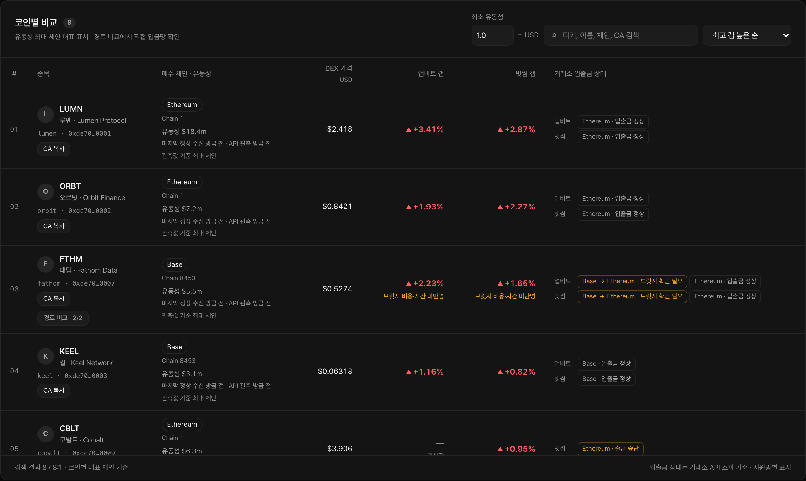
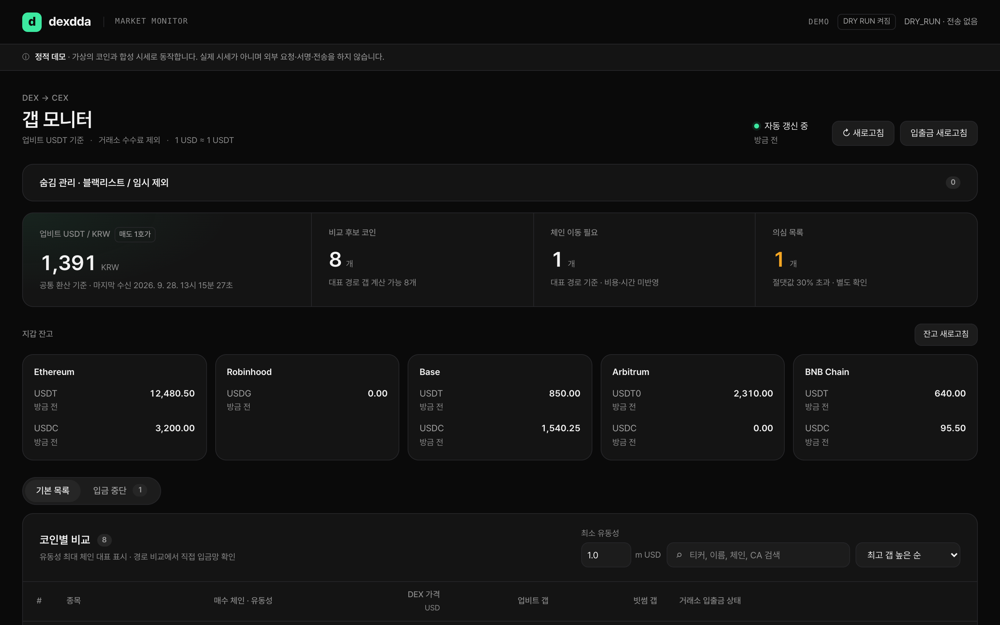
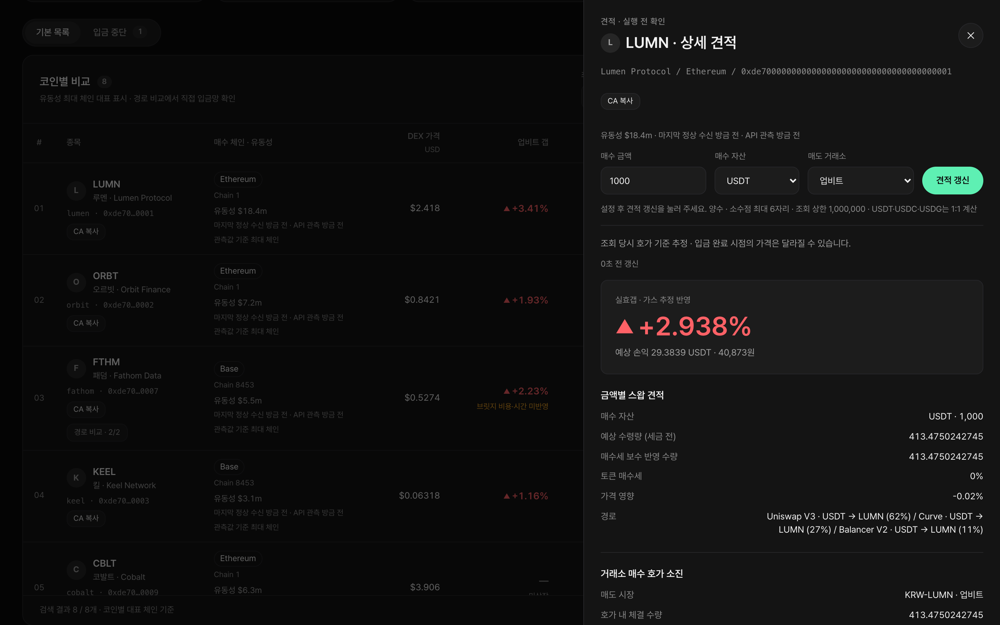
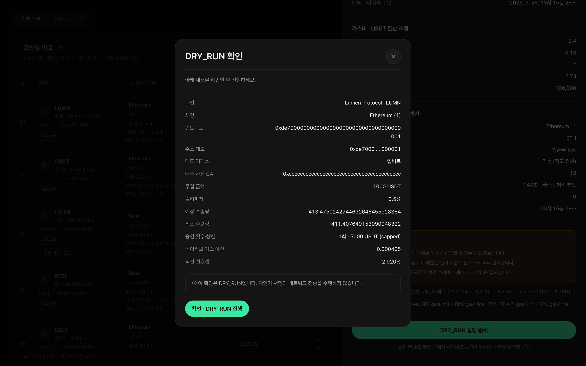
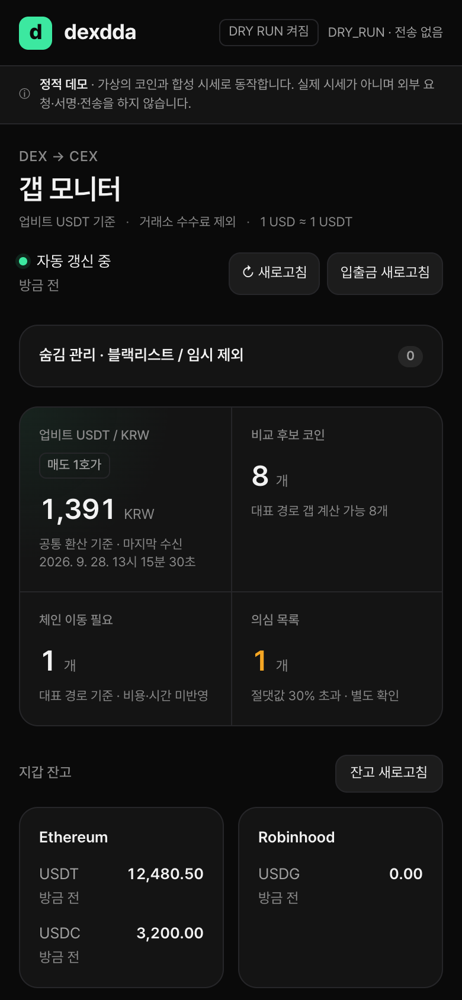
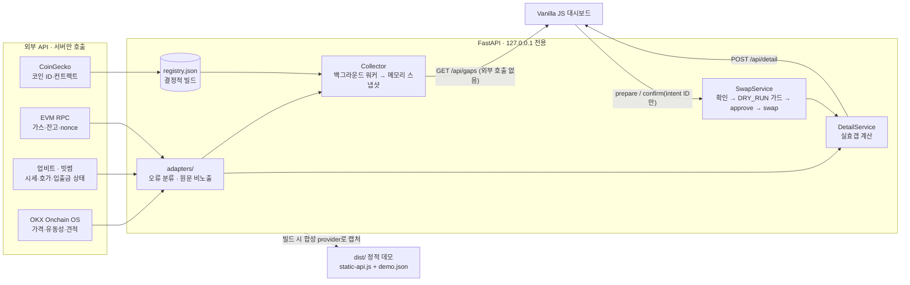

# dexdda — DEX↔CEX 갭 계산기

**DEX(OKX Onchain OS 애그리게이터)에서 사서 업비트·빗썸에서 팔 때의 가격 차이를, 입금 경로·호가 소진·가스비까지 반영해 보여 주는 로컬 대시보드.**

**데모:** [https://dexdda.com](https://dexdda.com) — 백엔드 없는 정적 빌드, 합성 데이터



> 스크린샷은 정적 데모(`dist/`)에서 찍었다. 코인 이름·가격·컨트랙트 주소(`0xde70…`)는 모두 **가상의 합성 데이터**이며 실제 시세가 아니다. 이 프로젝트는 개인 학습·도구 용도이고 투자 조언이 아니다.

| 개요 | 상세 견적 | DRY_RUN 확인 | 모바일 |
|---|---|---|---|
|  |  |  |  |

## 무엇을 하나

- **레지스트리** — CoinGecko 코인 ID + 체인 + 컨트랙트를 정체성으로 삼아, 업비트·빗썸 상장 종목을 29개 EVM 체인의 토큰과 결정적으로 연결한다. 표시명 추측은 하지 않는다. 확인이 필요한 항목은 리포트로 분리한다.
- **표면 갭** — 공통 환산 기준(업비트 USDT 매도 1호가)으로 `cex_krw / (dex_usd × usdt_krw) − 1`을 2초 주기로 갱신한다. 코인마다 유동성이 가장 큰 체인을 대표로 보여 주고, 다른 체인 경로는 펼쳐서 비교한다.
- **실효갭** — 금액별 DEX 견적, 거래소 매수 호가 소진, 승인·스왑·전송 가스비, 입금망 상태·컨펌 수를 합쳐 "지금 실행하면 얼마 남는지"를 계산한다.
- **확인 후 스왑** — 서버가 만든 intent만 확인할 수 있고, 기본값은 `DRY_RUN=true`(서명·전송 0회)다.
- **운영 보조** — 입금 중단 탭, 갭 상한 초과 "의심 목록", 코인·입금망 단위 숨김, 체인별 스테이블코인 잔고, 신규 상장 감지를 제공한다.

## 구조



- API 읽기 요청은 외부 호출을 하지 않는다. 워커가 모은 최신 메모리 스냅샷만 돌려준다. 그래서 브라우저 폴링 횟수와 외부 API 호출 제한이 서로 무관하다.
- 계층별 설명: [docs/architecture.md](docs/architecture.md) · 결정 기록: [DECISIONS.md](DECISIONS.md)

## 기술적 결정

| 결정 | 이유 |
|---|---|
| **금액은 `Decimal`·10진 문자열로만 전달** | 호가 소진·가스 환산에서 float 오차가 수익 판단을 뒤집지 않게 한다. JSON에도 문자열로 싣는다. |
| **비밀값은 화이트리스트로 정제** | 로그·진단·API 응답에는 허용한 필드만 싣는다. 키·JWT·서명·RPC 전체 URL·원문 응답은 정규식 마스킹이 아니라 구조적으로 제외한다. 테스트가 sentinel 값의 누출을 검사한다. |
| **실행은 서버 intent 기반** | `/api/swap/confirm`은 서버가 만든 intent ID만 받는다. 클라이언트는 calldata·금액·nonce를 바꿀 수 없다. tx hash와 nonce는 브로드캐스트 **전에** 원자적으로 기록하고, 자동 재전송은 하지 않는다. |
| **실행 체인 제한** | 비용 모델을 검증한 Ethereum·Polygon·Avalanche C만 실행한다. 나머지 체인은 조회 전용이며 비용을 0으로 가정하지 않는다. 브릿지 후보도 표시만 한다. |
| **로컬 전용 서버** | 호스트는 `127.0.0.1`로 고정한다. TrustedHost를 검사하고, 쓰기 요청에는 세션 토큰을 요구한다. Origin 헤더가 있으면 같은 출처인지도 검사한다. CORS는 열지 않는다. |
| **한국식 방향 색 + 기호** | 갭이 양수면 빨강 ▲, 음수면 파랑 ▼다. 빨강과 파랑은 휘도가 거의 같아 기호를 함께 붙인다. 민트 강조색은 선택·주 액션에만 쓰고, 상태 배지는 무채색·앰버로 표시한다. |
| **정적 데모도 실제 계산 경로를 거친다** | 데모용 프런트엔드를 따로 만들지 않았다. 실제 앱을 합성 provider로 실행해 응답을 캡처하므로 데모 수치도 같은 갭·실효갭·DRY_RUN 가드를 통과한다. |
| **외부 요청 0건 CSP** | `default-src 'none'`, `connect-src 'self'`, `require-trusted-types-for 'script'`. 외부 폰트·CDN·이미지를 쓰지 않는다. |

## 실행

### 정적 데모 (백엔드·키 불필요)

배포본: [https://dexdda.com](https://dexdda.com). 로컬에서 직접 빌드하려면:

```sh
uv sync --locked
uv run scripts/build_static.py          # dist/ 재생성 (이미 커밋돼 있음)
python3 -m http.server -d dist --bind 127.0.0.1 8080   # http://127.0.0.1:8080
```

`dist/`는 정적 호스팅에 그대로 올릴 수 있다. `dist/_headers`(Netlify·Cloudflare Pages 형식)에 CSP와 보안 헤더가 있다. 헤더를 지원하지 않는 호스트에서는 meta 태그의 CSP만 적용된다. 이 경우 `frame-ancestors`와 `X-Frame-Options` 같은 응답 헤더 전용 보호는 빠진다.

### 로컬 서버 (실제 API)

Python 3.12 이상과 [uv](https://docs.astral.sh/uv/)가 필요하다.

```sh
uv sync --locked
cp .env.example .env                    # 최초 1회. 기존 .env는 덮어쓰지 않는다
uv run scripts/smoke_test.py            # 읽기 전용 연결 검증
uv run scripts/build_registry.py        # 레지스트리 생성
uv run dexdda                           # http://127.0.0.1:8000
```

- `DRY_RUN=true`가 기본이다. 사용자만 `.env`에서 이 값을 바꿀 수 있다.
- 거래소 API 키에는 입금 조회·주소 생성 권한만 주고 허용 IP를 등록한다.
- 마일스톤별 사용법과 검증 기록은 [docs/](docs/)에 있다: [M3 대시보드](docs/m3-dashboard.md) · [M4 상세 견적](docs/m4-detail.md) · [M5–M7 실행·운영](docs/m5-m7-usage.md).

### 검증

```sh
uv run pytest -q                                   # 합성 fixture + httpx.MockTransport, 실제 API·.env 미사용
uv run ruff check src tests scripts
uv run ruff format --check src tests scripts
node scripts/check_ui.cjs                          # 오프라인 fixture 브라우저 검사 (Playwright + Chrome)
node scripts/check_static_ui.cjs                   # dist/를 30초 조작하며 외부 요청·CSP 위반 0건 확인
```

## 기술 스택

Python 3.12 · FastAPI · httpx · pydantic v2 · websockets · eth-account · PyJWT · Vanilla JS/CSS · Playwright · pytest · ruff · uv

## 라이선스

[MIT](LICENSE) © znan2
